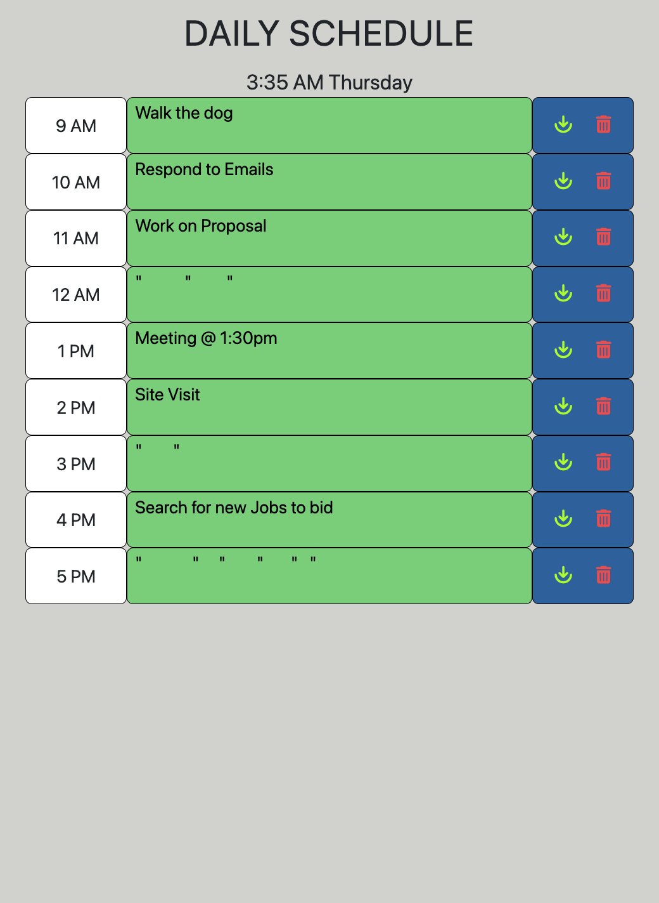

# Daily Planner

A planner that allows the user to schedule activities for each hour of the day. Colors adapt dynamically throughout the workday allowing the user to keep track of past, present, and future activities. A simple user-interface allows the user to easily log or delete the tasks from local storage.

## link

https://ianjustinferris.github.io/Daily_Planner/

## Screenshot

